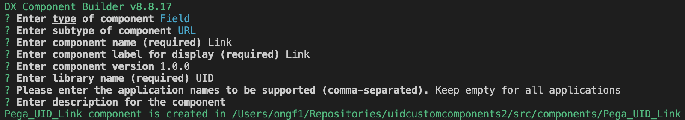
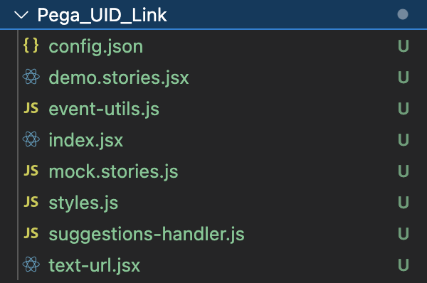
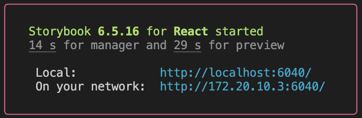
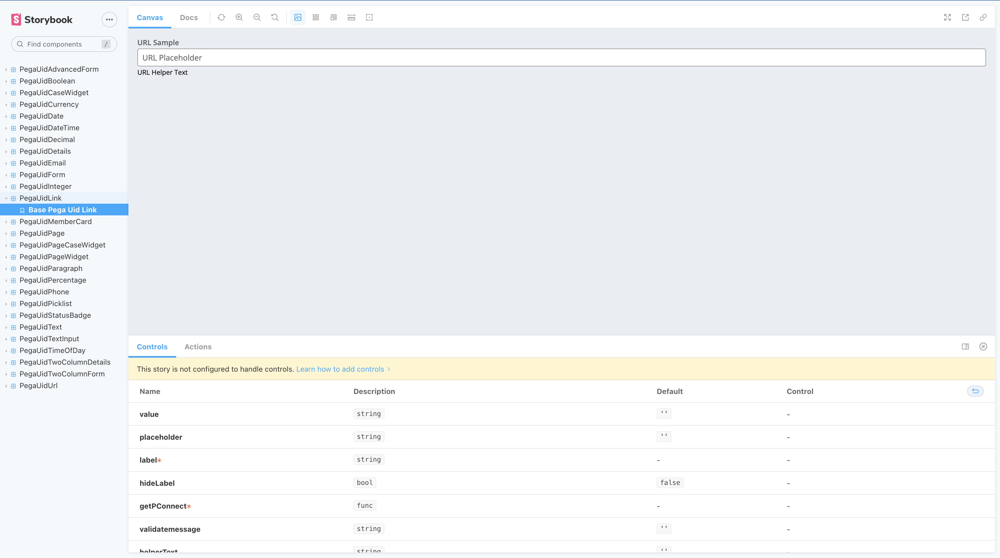
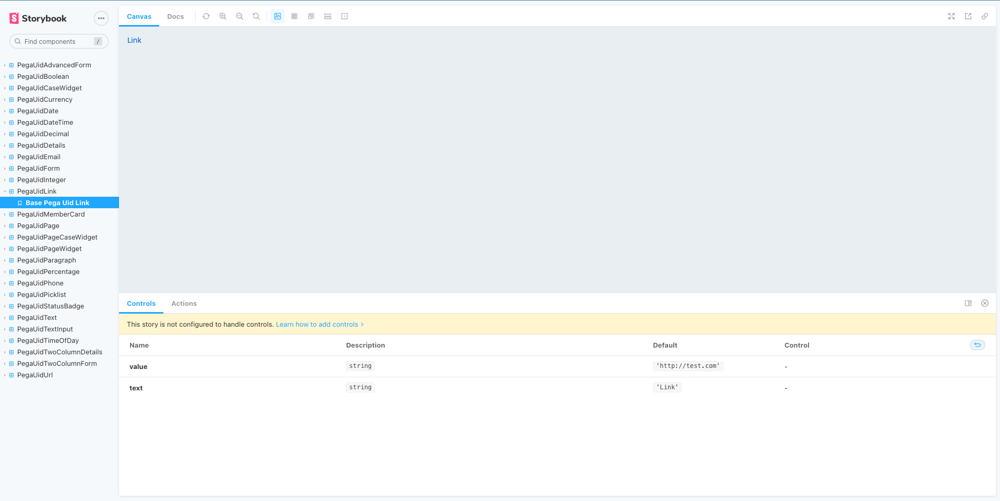
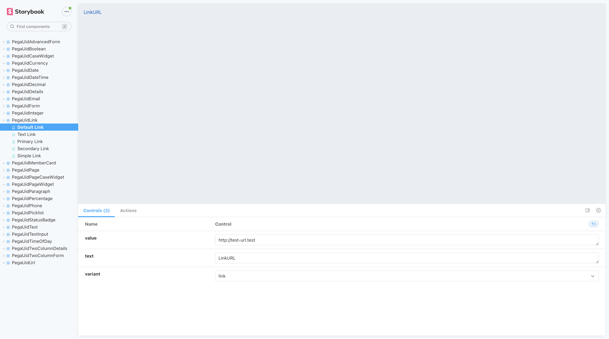
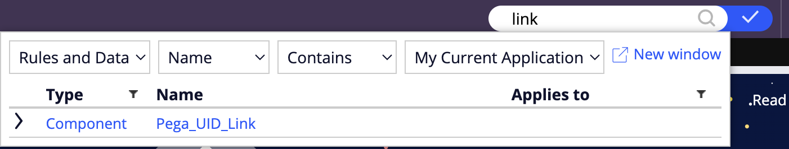
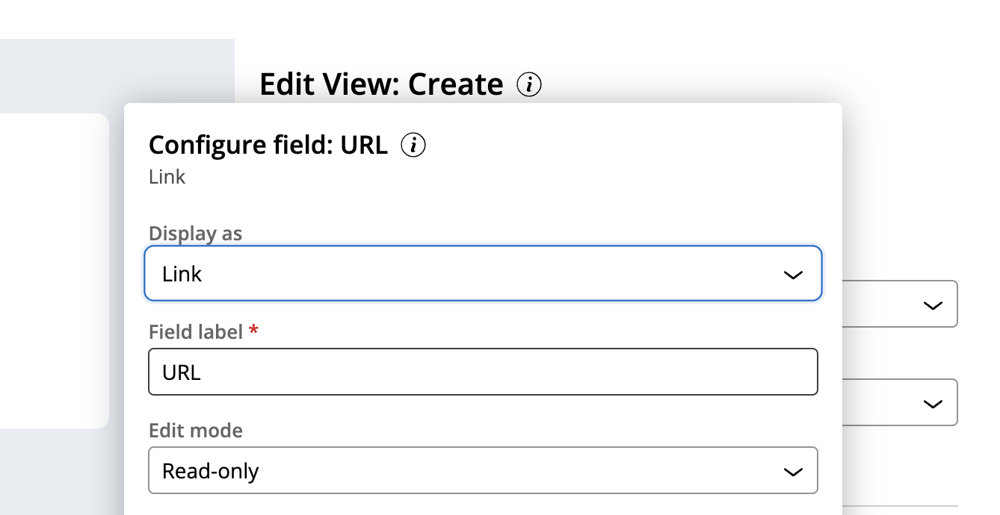
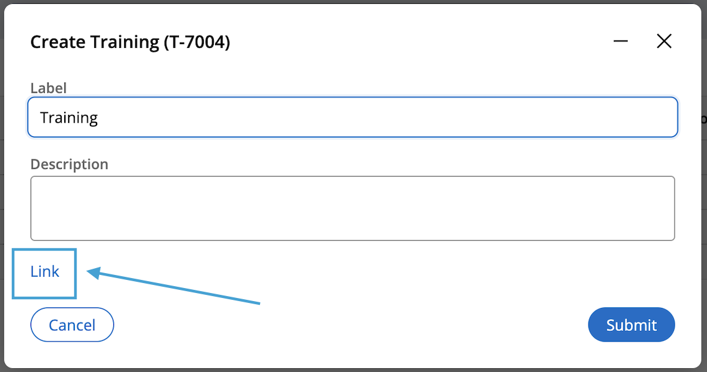

# Create a custom field

In [Constellation design system](https://design.pega.com/develop/), you'll find a lot of documentation.

Let's imagine we want to use a link but there is no link field in Pega.

Let's create a custom field.

We can find [here](https://design.pega.com/develop/link/) the link component provided by Constellation design system. Using this library will ensure a consistency in the look and feel. It is highly recommended to use Constellation design system elements as much as possible.

## Generate a field component

Run this command: `npm run create` and fill the questions until the component creation.



The component is available in `src/components`.



Let's run StoryBook to see what contains this new component : `npm run startStorybook`



As you can see in the console, it is possible to access from local link or network link.

A default field has been created :



## Develop the component

Let's get back to the [Constellation Link component](https://design.pega.com/develop/link/).
In `ìndex.js`, we develop the component logic.

```tsx
import PropTypes from 'prop-types';
import { Link } from '@pega/cosmos-react-core';

const PegaUidLink = props => {
  const { value, text } = props;

  return (
    <Link href={value} variant='link'>
      {text}
    </Link>
  );
};

PegaUidLink.defaultProps = {
  value: 'http://test.com',
  text: 'Link'
};

PegaUidLink.propTypes = {
  value: PropTypes.string,
  text: PropTypes.string
};

export default PegaUidLink;
```

We have put here default values and here is the display in Storybook:


## Configure Storybook

Let's start by converting `demo.stories.jsx` to `.tsx` extension.
We replace the content of the file by this:

```tsx
import { withKnobs } from '@storybook/addon-knobs';
import type { ComponentMeta, ComponentStory } from '@storybook/react';

import PegaUidLink from './index.jsx';

export default {
  title: 'PegaUidLink',
  decorators: [withKnobs],
  component: PegaUidLink,
  args: {
    value: 'http://test-url.test',
    text: 'LinkURL',
    variant: 'link'
  },
  argTypes: {
    variant: {
      options: ['link', 'text', 'primary', 'secondary', 'simple'],
      control: { type: 'select' }
    }
  }
} as ComponentMeta<typeof PegaUidLink>;

const Template: ComponentStory<typeof PegaUidLink> = args => {
  return <PegaUidLink {...args} />;
};

export const DefaultLink = Template.bind({});
DefaultLink.args = { ...DefaultLink.args };

export const TextLink = Template.bind({});
TextLink.args = { ...TextLink.args, variant: 'text' };

export const PrimaryLink = Template.bind({});
PrimaryLink.args = { ...PrimaryLink.args, variant: 'primary' };

export const SecondaryLink = Template.bind({});
SecondaryLink.args = { ...SecondaryLink.args, variant: 'secondary' };

export const SimpleLink = Template.bind({});
SimpleLink.args = { ...SimpleLink.args, variant: 'simple' };
```

If needed, check [Storybook documentation](https://storybook.js.org/docs/react/writing-stories/introduction) to understand how to write stories.

With the code above, here is what we have now:



The user will be able to switch between pre-configured fields in the side panel and to directly configure the component in the Controls part at the bottom.

## Use the component in Pega

To be able to use the component in Pega instance, we need to publish it to Constellation server.

Make sure to be [authenticated](https://docs.pega.com/bundle/constellation-dx-components-88/page/constellation-dx-components/custom-components/authenticate-user.html) before publishing the component with `npm run publish` command.

Check the documentation for additional details [here](https://docs.pega.com/bundle/constellation-dx-components-88/page/constellation-dx-components/custom-components/publish-custom-components.html).

Once the publishing is done, you can find your component in Pega :



And use it in your case, it can be easily configured in an URL field, with the `Display as` dropdown :



Finally, here is the result of your wonderful field :



Good job ! 🥳


## Useful links

- [Custom Components Cosmos React](https://docs.pega.com/bundle/constellation-dx-components-88/page/constellation-dx-components/custom-components/custom-components-cosmos-react.html)
- [DX Component Builder](https://docs.pega.com/bundle/constellation-dx-components-88/page/constellation-dx-components/custom-components/lifecycle-dx-cosmos-components.html)
